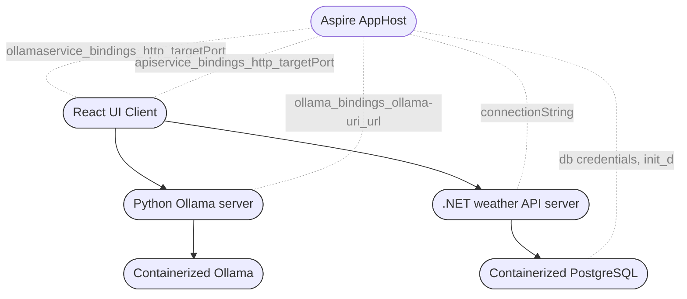
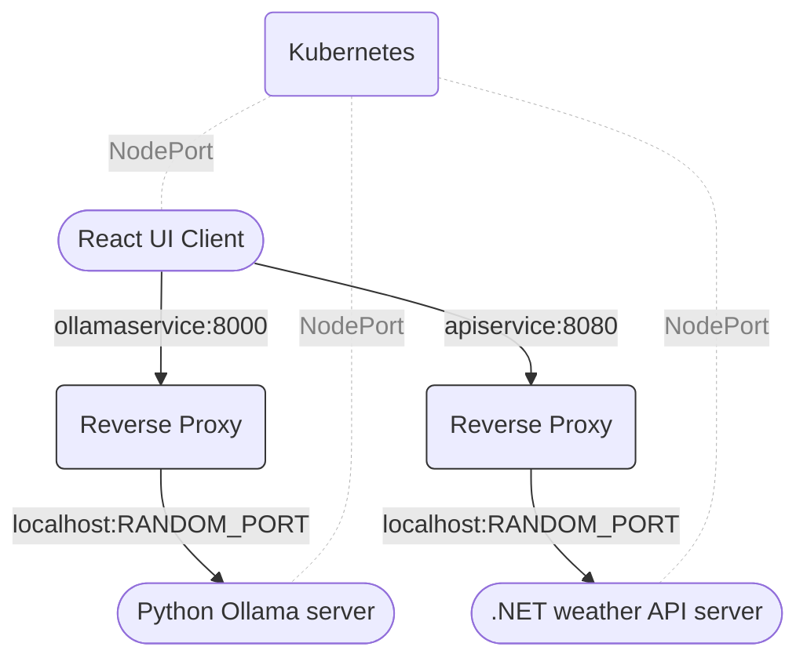

#### Read more about the project in [my article](https://cynicdog.github.io/posts/azure-aspire-with-containerized-ollama/). 📰

#### Architecture of AspirngOllama 

#### Reverse proxy details

  
First look in to the app 👀

  </img>

  
Aspire Dashboard 👨‍🏫

  </img>

  
Local Kubernetes deployment details ⚓

  </img>

