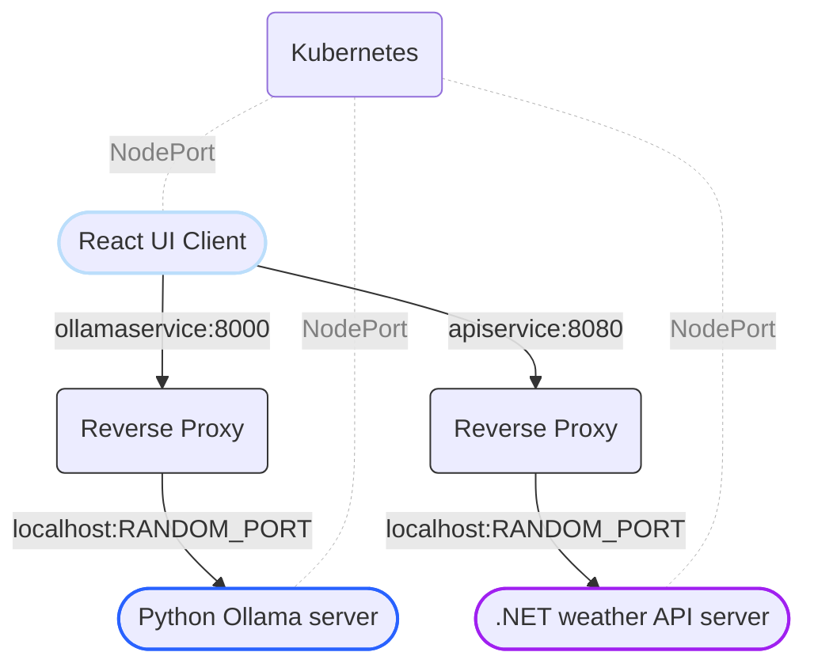

#### Read more about the project in [my article](https://cynicdog.github.io/posts/azure-aspire-with-containerized-ollama/) 📰

#### Architecture of AspirngOllama 

``` mermaid
flowchart TD
    
    A([React UI Client]) --> B([Python Ollama server])
    B --> E([Containerized Ollama])
    A --> C([.NET weather API server])
    C --> D([Containerized PostgreSQL])
    F([Aspire AppHost]) -. ollamaservice_bindings_http_targetPort .- A
    F -. apiservice_bindings_http_targetPort .- A
    F -. connectionString .- C
    F -. ollama_bindings_ollama-uri_url .- B
    F -. db credentials, init_d .- D
     
    classDef container stroke:#333,stroke-width:1px;
    class A,C,D,E container;

    classDef react stroke:#BBDEFB,stroke-width:2px;
    class A react

    classDef python stroke:#2962FF,stroke-width:2px;
    class B python

    classDef dotnet stroke:#A020F0,stroke-width:2px;
    class C dotnet

    linkStyle 4,5,6,7,8 stroke-width:.3px,color:grey;
```


#### Reverse proxy details


#### Commands to deploy the app on local Kubernetes context  

To create .NET Aspire app host manifest, which is created by running the next command in the AppHost project directory:

```bash 
dotnet run --project ./AspireReact.AppHost.csproj --publisher manifest --output-path ./manifest.json  
```

Now we initialize the deployment YML files generation process with:    

```bash
aspirate init
aspirate build -m ./manifest.json
```

During this process, you’ll need to set a password to secure secrets and the deployment process, as well as specify the components (individual services in this project) to deploy.  

The following command generates the deployment YAML files:

```bash
aspirate generate --skip-build 
```

At this point, you'll need to set the image pull policy and custom namespace. This command creates a directory named `aspirate-output` containing all the deployment specifications. 

The final step is to run the next command:

```bash
aspirate run -m ./manifest.json --skip-build
```

You’ll choose the Kubernetes context for deployment. If the `default` namespace isn’t empty, it needs to be cleared by confirming with the 'y' option.

If deployed successfully, the following report will be shown. Note that the NodePorts and IPs are dynamically set values. 

```bash
── Deployment completion: Outputting service details ───────────────────────────────────────────
┌──────────────────┬──────────────┬───────────────┬───────┬───────────┬────────────────────────┐
│ Service Name     │ Service Type │ Cluster IP    │ Port  │ Node Port │ Address                │
├──────────────────┼──────────────┼───────────────┼───────┼───────────┼────────────────────────┤
│ apiservice       │ NodePort     │ 10.99.48.221  │ 8080  │ 32659     │ http://localhost:32659 │
│ aspire-dashboard │ NodePort     │ 10.97.75.21   │ 18888 │ 32553     │ http://localhost:32553 │
│ ollamaservice    │ NodePort     │ 10.97.221.178 │ 8000  │ 30728     │ http://localhost:30728 │
│ react            │ NodePort     │ 10.98.14.171  │ 5173  │ 31488     │ http://localhost:31488 │
└──────────────────┴──────────────┴───────────────┴───────┴───────────┴────────────────────────┘
```

<details>
  <summary>First look in to the app 👀</summary>
  </img>
</details>

<details>
  <summary>Aspire Dashboard 👨‍🏫</summary>
  </img>
</details>

<details>
  <summary>Local Kubernetes deployment details ⚓</summary>
  </img>
</details>
